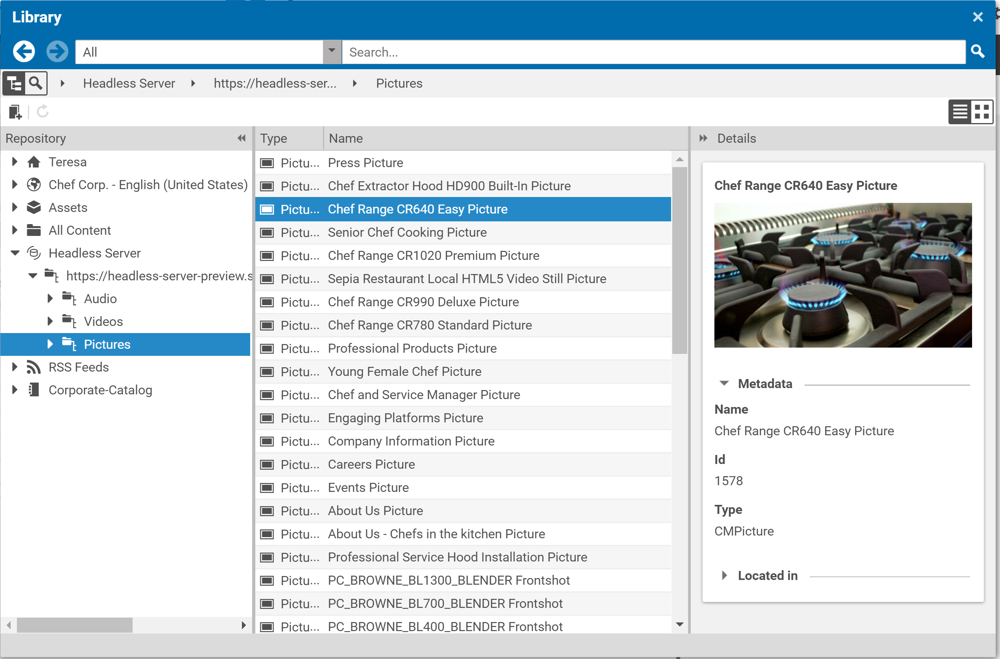
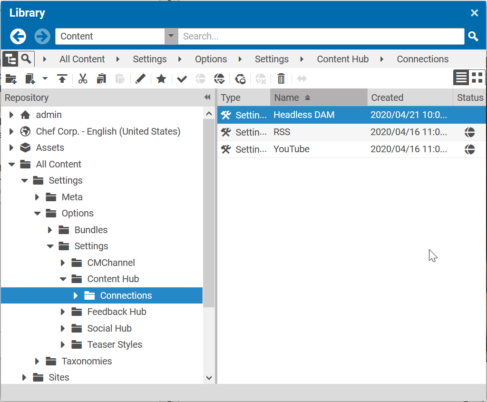
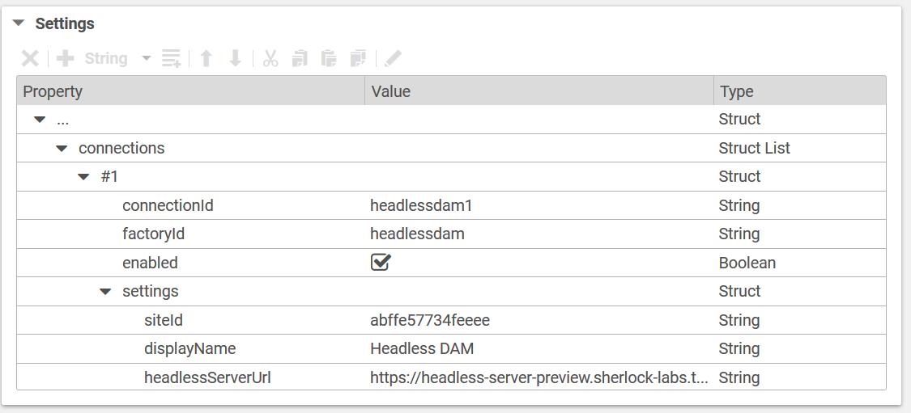
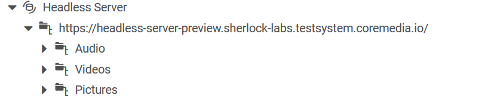

# Implementing a Content Hub Adapter for CoreMedia Assets

## Versioning

The implementation of this tutorial may differ depending on the CoreMedia version you are using.
To ensure that the version is compatible, please check for the corresponding branch name.
For example, if your CoreMedia version is 2001.2, checkout the branch "2001.2" of this tutorial. 

## Introduction

In this tutorial we show how a Headless Server client can be implemented with Java in order to access CoreMedia assets.
It can be used for integrations into a digital asset management systems (DAM), social media or marketing tools.
 
We simulate a DAM here by writing an integration for the CoreMedia Content Hub as well.
While it is not useful to access CoreMedia through the Content Hub/Headless Server from CoreMedia, this example
shows
 
- how easy the Headless Server can be integrated into external systems.
- how the Content Hub can be used to connect with external systems.




Because the sources of the tutorial are more complex, we start with integrating the resulting code of the tutorial into the CoreMedia workspace.
We then explain the details and important parts of the code. 

## Prerequisites

This tutorial assumes that you have already developed with the CoreMedia Blueprint workspace.
It also assumes that you already know what the CoreMedia Content Hub is.

## Project Setup

The sources of this tutorial are provided as a CoreMedia extension. 
Install the extension by copying the _content-hub-adapter-headless-server-dam_ folder 
into the _modules/extensions/_ folder of your CoreMedia workspace. If they do not exist, just create these folders.

After copying, use the extension tool in the root folder of the workspace to link the extensions into the CoreMedia apps:

 ```
mvn -f workspace-configuration/extensions com.coremedia.maven:extensions-maven-plugin:LATEST:sync -Denable=content-hub-adapter-headless-server-dam
```

Once the extension tool has been executed successfully, rebuild the workspace and afterwards start your Studio.
The Content Hub extension "Headless DAM" is now part of your Studio, but you have to provide a configuration
in order to enable the extension.

The Content Hub allows global, site-specific and user-specific connections.
Simply create the connection settings document _Headless DAM_ in the global settings folder of the Content Hub:



Inside the document configure the _settings_ section as described below: 



| Property          | Description   |
| ----------------- | ------------- |
| siteId            | The site ID of the CoreMedia site from which the adapter should retrieve assets |
| displayName       | The display name of the root node inside the Studio library |
| headlessServerUrl | The headless server URL (without 'graphql' suffix!) |

Note that the value of the _headlessServerUrl_ can be the preview or live URL of the headless server.

The XML export of the "Head DAM" settings document looks like this:

```xml
<?xml version="1.0" encoding="UTF-8" ?>
<CMSettings folder="/Settings/Options/Settings/Content Hub/Connections" name="Headless DAM">
  <externalRefId></externalRefId>
  <locale></locale>
  <master>
  </master>
  <settings>
    <Struct xmlns="http://www.coremedia.com/2008/struct">
      <StructListProperty Name="connections">
        <Struct>
          <StringProperty Name="connectionId">headlessdam1</StringProperty>
          <StringProperty Name="factoryId">headlessdam</StringProperty>
          <BooleanProperty Name="enabled">true</BooleanProperty>
          <StructProperty Name="settings">
            <Struct>
              <StringProperty Name="displayName">Headless DAM</StringProperty>
              <StringProperty Name="siteId">abffe57734feeee</StringProperty>
              <StringProperty Name="headlessServerUrl">https://headless-server-preview.sherlock-labs.testsystem.coremedia.io/</StringProperty>
            </Struct>
          </StructProperty>
        </Struct>
      </StructListProperty>
    </Struct>
  </settings>
  <identifier></identifier>
</CMSettings>
```

After creating the settings document, reload Studio. 
The headless server folder inside the Studio library should be visible and assets can be browsed.


## Content Hub Adapter Setup

Although this tutorial focuses on the Headless Server, let's have a brief look on the Content Hub adapter setup.
The sources of this tutorial consist of two Maven modules:

#### Module _headless-server-dam-studio_ 

This module contains the Studio sources for the Content Hub adapter. It contains only resource bundles and 
no additional logic. 

For details of how to customize labels and icons for a Content Hub adapter, 
please check the section "Customizing Labels and Icons"
in the Content Hub chapter of the Studio Developer Guide (https://documentation.coremedia.com/cmcc-10/artifacts/2001/webhelp/studio-developer-en/content/Content_Hub.html).

#### Module _headless-server-dam-studio-lib_

This module contains the Java sources of the Headless DAM Content Hub adapter.
It consists of two parts: 

* The classes required for the adapter
* The classes which implement access to the Headless Server 

The setup of the adapter is pretty straight forward: 

The entry point of the adapter is the Spring configuration class
__HeadlessDAMConfiguration__ which creates the __HeadlessDAMContentHubAdapterFactory__ which then creates instances 
of the __HeadlessDAMContentHubAdapter__ for each connection configuration found during runtime.

As shown in the screenshot below, the folder structure generated by the __HeadlessDAMContentHubAdapter__ is pretty simple: 
it contains one root folder with three different subfolders, one for each media type.



The folder structure is static. 
The folder objects are created inside the constructor of the __HeadlessDAMContentHubAdapter__:

```java
rootId = new ContentHubObjectId(connectionId, HeadlessDAMFolder.ROOT_FOLDER);
rootFolder = new HeadlessDAMFolder(headlessServerUrl, rootId, new ContentHubType("headlessdam"));

ContentHubObjectId audioId = new ContentHubObjectId(connectionId, HeadlessDAMFolder.AUDIO_FOLDER);
audioFolder = new HeadlessDAMFolder("Audio", audioId, new ContentHubType("headlessdam"));

ContentHubObjectId videoId = new ContentHubObjectId(connectionId, HeadlessDAMFolder.VIDEO_FOLDER);
videoFolder = new HeadlessDAMFolder("Videos", videoId, new ContentHubType("headlessdam"));

ContentHubObjectId picturesId = new ContentHubObjectId(connectionId, HeadlessDAMFolder.PICTURES_FOLDER);
picturesFolder = new HeadlessDAMFolder("Pictures", picturesId, new ContentHubType("headlessdam"));
```

They are returned by the __getFolder__ method which returns the folder 
depending on the given __externalId__ stored in the __ContentHubObjectId__.

```java
  @Nullable
  @Override
  public Folder getFolder(@NonNull ContentHubContext context, @NonNull ContentHubObjectId id) {
    String externalId = id.getExternalId();
    switch (externalId) {
      case HeadlessDAMFolder.ROOT_FOLDER:
        return rootFolder;
      case HeadlessDAMFolder.AUDIO_FOLDER:
        return audioFolder;
      case HeadlessDAMFolder.VIDEO_FOLDER:
        return videoFolder;
      case HeadlessDAMFolder.PICTURES_FOLDER:
        return picturesFolder;
      default:
        throw new UnsupportedOperationException("Invalid headless DAM id '" + externalId + "'");
    }
  }
```

You only need two different Headless Server calls to retrieve the Content Hub items for each of these folders.

- One call to search all items of the given media type, returned by the method __public List<Item> getItems(@NonNull ContentHubContext context, @NonNull Folder folder)__.
- One call to retrieve the details of each item, returned by the method __public Item getItem(@NonNull ContentHubContext context, @NonNull ContentHubObjectId id)__.

Both calls are implemented in class __HeadlessServerConnector__ which is created for every instance of __HeadlessDAMContentHubAdapter__.

___Note that for the sake of simplicity we did not implement methods 
to support searching and content creation via Content Hub!___


## Headless Server Requests

The Headless Server is accessed through an instance of the class __HeadlessServerConnector__.
Instances of this class are created with the URL of the Headless Server.
It executes requests using a Spring Rest Template which is responsible for converting the returned JSON into Java objects.

The GraphQL is passed in JSON format as payload for these requests.
This JSON is generated through the utility classes __SearchQuery__ and __ContentQuery__.

Every call generates an instance of __QueryResponseDocument__ which contains the content details or the search results.

#### Class _SearchQuery_ 

The class __SearchQuery__ generates a JSON string with a GraphQL query to retrieve all assets 
of a specific type from a specific CoreMedia site. It requires the parameters __sideId__ and __type__ which are
then replaced inside the query template string.

For example, for __siteId__ "abffe57734feeee" and __type_ "CMPicture" the YAML of the GraphQL query would look like this:

```yaml
{
  content {
    search(query: "*", offset: 0, limit: 1000, docTypes: ["CMPicture"], sortFields: [MODIFICATION_DATE_ASC], siteId:"abffe57734feeee") {
     numFound,
     result {
       ... on CMTeasable {
          creationDate, 
          name,           
          title,           
          type,           
          link {id}, 
          picture {            
            data { 
              size ,
              contentType
            },
            uriTemplate,
            crops {
              name,
              minWidth              
            }          
          }
        }
    }
    }
  }
}
```

Since the repository view of the Studio library does not support any additional filtering, we simply extend 
the search limit to 1000 entries.

The query executed by the __HeadlessServerConnector__ returns a __QueryResponseDocument__.
The __HeadlessDAMContentHubAdapter__ accesses the search results via __queryResponseDocument.getData().getContent().getSearch().getResults()__
and converts every __CMTeaseableDocument__ into a Content Hub item.

#### Class _ContentQuery_ 

The class __ContentQuery__ generates a JSON string with a GraphQL query to retrieve the details of an asset.
It requires the parameter __id__ which is then replaced inside the query template string.

For example, for __id__ "2022" the YAML of the GraphQL query would look like this:

```yaml
{
  content {
    content(id:"2022") {
       ... on CMTeasable {
          creationDate, 
          modificationDate,
          title,           
          name,
          type,
          teaserText,
          remoteLink,
          link {id},
          picture {            
            data { 
              size ,
              contentType
            },
            uriTemplate,
            crops {
              name,
              minWidth              
            }          
          }
        }
    }
  }
}
```

The query executed by the __HeadlessServerConnector__ returns a __QueryResponseDocument__.
The __HeadlessDAMContentHubAdapter__ accesses the result via __queryResponseDocument.getData().getContent().getContent()__
and converts the __CMTeaseableDocument__ into a Content Hub item.

## Conclusion

We've demonstrated how the Headless Server can be used to access assets and have shown how these assets can
be accessed through the Content Hub in CoreMedia Studio.

We've shown how the Headless Server requests can be implemented via Spring Rest Templates.
If you have to build more complex GraphQL queries for the Headless Server it's worth to try the 
Apollo framework (https://www.apollographql.com/) which is the industry-standard GraphQL implementation, 
providing the data graph layer that connects modern apps to the cloud.  
