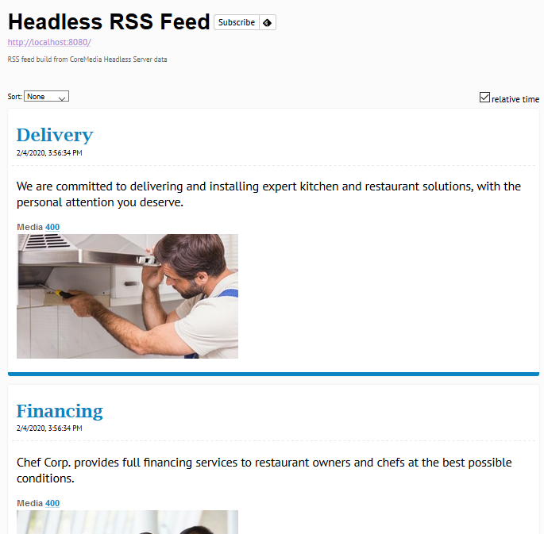

# Implementing an RSS Feed with node.js and the CoreMedia Headless Server 

## Introduction

This tutorials explains how to write a Node.js application that connects with the CoreMedia headless server.
The result is a webapp that delivers an RSS feed with selected CoreMedia teaser documents.

## Prerequisites

- Make sure that you have node.js installed (this tutorial was developed with node 12.16).
- Make sure that you have npm installed.
- Make sure that you have access to a CoreMedia system which includes a headless server.

## Implementation Steps

### Step 1: Project Setup

For starting the development, we first have to setup a new project first. For node.js this is rather simple:

- Create a new folder called _headless-server-rss-feed_.
- Create a new file called _package.json_ within it and paste the following content into it:

```json
{
  "name": "headless-server-rss-feed",
  "version": "1.0.0",
  "description": "A sample application for the CoreMedia Headless Server",
  "main": "index.js",
  "scripts": {
    "start": "node index.js",
    "test": "echo \"Error: no test specified\" && exit 1"
  },
  "repository": {
    "type": "git",
    "url": "https://github.com/CoreMedia/headless-server-tutorial"
  },
  "keywords": [],
  "author": "",
  "license": "CoreMedia Open Source License"
}
```

- Create a new file called _index.js_ within it. This is the main executable of our example . 
We want to start with a simple "Hello World" program. So we create a webserver via node.js that returns a "Hello World" message: 

```javascript
var http = require('http');

http.createServer(function (req, res) {
  res.writeHead(200, {'Content-Type': 'text/plain'});
  res.end('Hello World!');
}).listen(8080);

console.log("Started HTTP Server (http://localhost:8080)");
```

You can now open a command line tool and execute the script with:

```
npm start
``` 

Visit http://localhost:8080 and you will see the "Hello World!" message.


### Step 2: Build a GraphQL Query for the CoreMedia Headless Server

The default CoreMedia installation comes with a headless server that can be accessed using 'Headless Server' link on the the system overview page.
In this section you find a _GraphiQL_ link where you can test GraphQL queries in your browser:

- Open the you https://<YOUR_COREMEDIA_SYSTEM>/graphiql
- Paste the following query example into the query section of the website and press the execute button in the toolbar.

```
query {
  content {
    sites {
      name,
      id
    }
  }
}
```  

As a result you will get a list of all available sites on your system, including their ids.
Note the _id_ of your site, we need it for our next query. Since we want to create an RSS feed,
we need the title, teaser text and a picture (if available) of all recently modified articles.
The following snippet shows an example query for this using the "Chef Corp. (US)" site id _abffe57734feeee_:

```
{
  content {
    search(query: "*", offset: 3, limit: 10, docTypes: ["CMArticle"], sortFields: [MODIFICATION_DATE_ASC], siteId: "abffe57734feeee") {
      numFound
      result {
        ... on CMArticle {
          creationDate, 
          title,           
          teaserText,
          remoteLink,
          picture {
            uriTemplate,
            crops {
              name,
              minWidth              
            }
          }
        }
      }
    }
  }
}
```

In this example we are using the search the CoreMedia Blueprint Headless Server provides ootb.
The search is limited to 10 items and restricted to the content type _CMArticle_ and the site with the id _abffe57734feeee_.

Using the `... on CMArticle` expression, the search result expands every _CMArticle_ result using the fields _creationDate_,
_title_, _teaserText_ and _remoteLink_.

Additionally, we query the picture with it's caas URL which contains the available crops and minimum sizes which we want to use for our RSS feed.

A single result item of the given list might look like this:

```json
  {
    "creationDate": "2020-02-04T15:56:32Z[GMT]",
    "title": "You Are The Perfect Chef",
    "teaserText": "<div><p>New technology allows for so much more. Get a feeling for what is possible.</p></div>",
    "remoteLink": "//preview.sherlock-labs.testsystem.coremedia.io/blueprint/servlet/corporate/details/you-are-the-perfect-chef-7696",
    "picture": {
      "uriTemplate": "/caas/v1/media/6916/data/d1cc90760a1b2dbf3059de971d969363/{cropName}/{width}"
    }
  }
```


### Step 3: Execute GraphQL Query

In this step, we want to query the data using our node.js program. For requesting the data, we are gonna install
the _node-fetch_ module which support promises and is therefore a little bit more comfortable than the standard http post
provided by node.js.

```
npm install node-fetch
```

Once we have installed _node-fetch_, add the following statement at the beginning of your _index.js_:

```
var fetch = require("node-fetch");
```

Next, paste the following snippet at the end of your _index.js_ and replace the _<YOUR_COREMEDIA_SYSTEM>_ placeholder
with the domain of your CoreMedia system:

```javascript
var headlessServerUrl = "https://<YOUR_COREMEDIA_SYSTEM>/";

function fetchFeedData() {
  return fetch(headlessServerUrl + 'graphql', {
    method: 'POST',
    headers: {
      'Content-Type': 'application/json',
      'Accept': 'application/json',
    },
    body: JSON.stringify({
      query: "{\n" +
              "  content {\n" +
              "    search(query: \"*\", offset: 3, limit: 10, docTypes: [\"CMArticle\"], sortFields: [MODIFICATION_DATE_ASC], siteId: \"abffe57734feeee\") {\n" +
              "      numFound\n" +
              "      result {\n" +
              "        ... on CMArticle {\n" +
              "          creationDate, \n" +
              "          title,           \n" +
              "          teaserText,\n" +
              "          remoteLink,\n" +
              "          picture {\n" +
              "            uriTemplate,\n" +
              "            crops {\n" +
              "              name,\n" +
              "              minWidth              \n" +
              "            },            \n" +
              "          }\n" +
              "        }\n" +
              "      }\n" +
              "    }\n" +
              "  }\n" +
              "}"
    })
  })
          .then(r => r.json())
          .then(data => {
            console.log('data returned:', data.data.content.search.result.length);
            return data.data.content.search.result;
          });
}

fetchFeedData();
```

Execute the program with _npm start_. You should see the following output (assuming you have at least 10 _CMArticle_ documents for your site):

```
> headless-server-rss-feed@1.0.0 start C:\workspace\headless-server-tutorial\headless-server-rss-feed
> node index.js

Started HTTP Server (http://localhost:8080)
data returned: 10
```


### Step 4: Convert Response JSON to RSS Feed XML

Before our webserver can serve RSS XML, we need to convert the response JSON to XML.
For creating the feed, we use the library npm library _rss_ (https://www.npmjs.com/package/rss):

```
npm install rss
```

After adding the RSS library at the beginning of our _index.js_

```
var RSS = require('rss');
```

we can write the function that converts the JSON object into RSS XML.
Append to the following snippet at the end of your _index.js_:

```javascript
function toFeedXML(data) {
  //create the feed itself
  var feed = new RSS({
    title: 'Headless RSS Feed',
    description: 'RSS feed build from CoreMedia Headless Server data',
    feed_url: 'http://localhost:8080',
    language: 'en'
  });

  //iterate over the article records and create feed items
  for (let i = 0; i < data.length; i++) {
    var entry = data[i];
    feed.item({
      title:  entry.title,
      description: entry.teaserText,
      date: entry.creationDate.substr(0, 19),
      url: 'https:' + entry.remoteLink,
      enclosure: {
        'url'  : formatPictureUrl(entry.picture),
        'type' : 'image/jpeg'
      }
    });
  }

  //return the RSS XML
  return feed.xml();
}

//helper for formatting image URLs
function formatPictureUrl(picture) {
  let url = picture.uriTemplate.replace('{cropName}', picture.crops[0].name).replace('{width}', picture.crops[0].minWidth);
  return headlessServerUrl + url;
}
```

### Step 5: Adapting the Server

As a final step, we only have to adapt the webserver to return the XML and the correct mime type: 

```javascript
http.createServer(function (req, res) {
  fetchFeedData().then(data => {
    let xml = toFeedXML(data);
    res.writeHead(200, {'Content-Type': 'application/rss+xml'});
    res.end(xml);
  });
}).listen(8080);
```

After these changes our RSS feed is finished. You can restart the server with `npm start` and invoke the URL in browser.
Assuming you have an RSS reader plugin installed in your browser, the result might look something like this:


 
 
 ## Conclusion
 
 